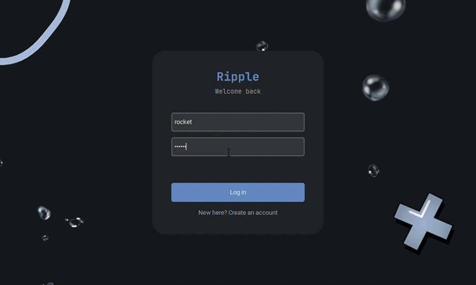
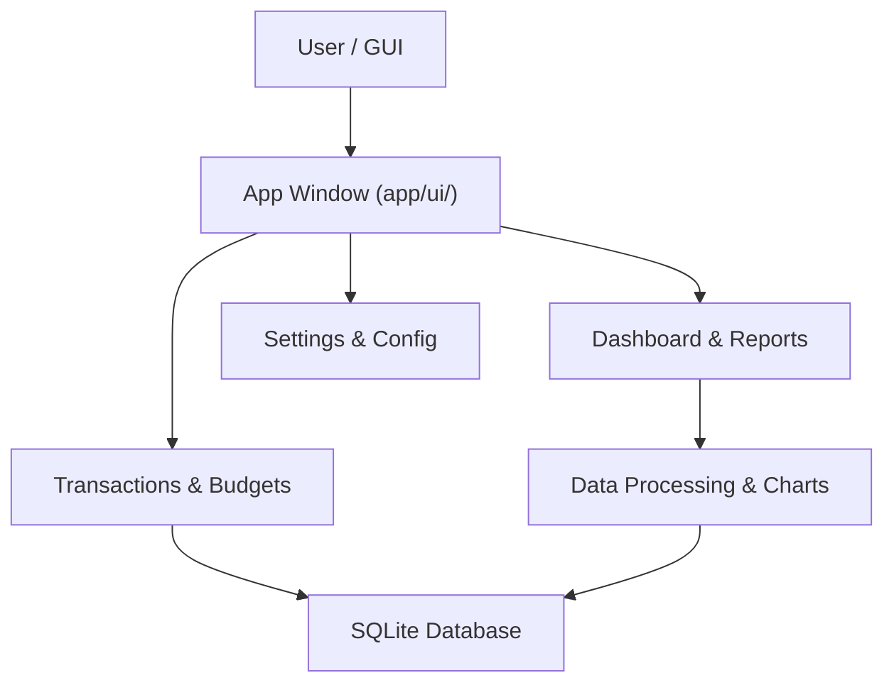
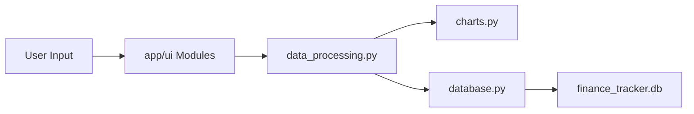

<div align="center">

# 「Ripple」: Finance-Tracker

**The all-new, all-different finance-tracking application with intuitive visual tracking, budgets, and reporting now back with a sleeker design**

[](https://www.python.org/)
[](https://www.sqlite.org/)
[](https://github.com/JEmmanuelAbishai/finance-tracker-gui/releases/latest)
[](https://github.com/JEmmanuelAbishai/finance-tracker-gui)

</div>

---

## Demo

<div align="center">



<div> Overview of the app </div>
</div>

---

## Quick Download (v1.0.0)

Looking for a ready-to-run executable without setting up Python? Grab the latest release:

- **[Download v1.0.0 `.exe` Release](https://github.com/JEmmanuelAbishai/finance-tracker-gui/releases/tag/v1.0.0)**

---

## Overview

A privacy-first desktop application that tracks income, expenses, budgets, and financial reports entirely **local-first**. By leveraging a local SQLite database (`finance_tracker.db`) and a modular graphical user interface, the application provides secure and instant insight into your spending habits without external cloud dependencies.

**Domain:** Personal Finance & Desktop Productivity  
**Framework:** Python, CustomTkinter / Tkinter, Matplotlib  
**Status:** Active Development

---

## System Architecture

The architecture connects desktop user interface modules with local data processing and SQLite persistence.



---

## Module Pipeline

The data flows from user interaction through processing and charting modules before persisting to storage.



---

## Features

- **Privacy First**: All data is stored locally in an embedded SQLite database; no financial records leave your machine.
- **Real-time Analytics**: Built-in Dashboard with `matplotlib` visualizations of budget distributions and monthly trends.
- **Flexible Management**: Easily switch between transaction logs, budget definitions, and graphical reports.
- **Modular Design**: Clean separation of UI views, data processing, and database handlers.

## Getting Started

### Option A: Run from Executable (Recommended for Windows Users)
1. Head over to the **[v1.0.0 Release Page](https://github.com/JEmmanuelAbishai/finance-tracker-gui/releases/tag/v1.0.0)**.
2. Download the compiled `.exe` file.
3. Double-click the executable to launch the application.

### Option B: Run from Source
```bash
# Clone the repository
git clone https://github.com/JEmmanuelAbishai/finance-tracker-gui.git
cd finance-tracker-gui

# Install dependencies
pip install -r requirements.txt

# Run the application
python main.py
```

1. Ensure Python 3.x is installed on your system.
2. Run `python main.py` to launch the graphical user interface.

## Authors & Contributors

| Name | Role | Key Contribution |
| :--- | :--- | :--- |
| [JEmmanuelAbishai](https://github.com/JEmmanuelAbishai) | Lead Developer | Core architecture, GUI modules, and database integration. |
