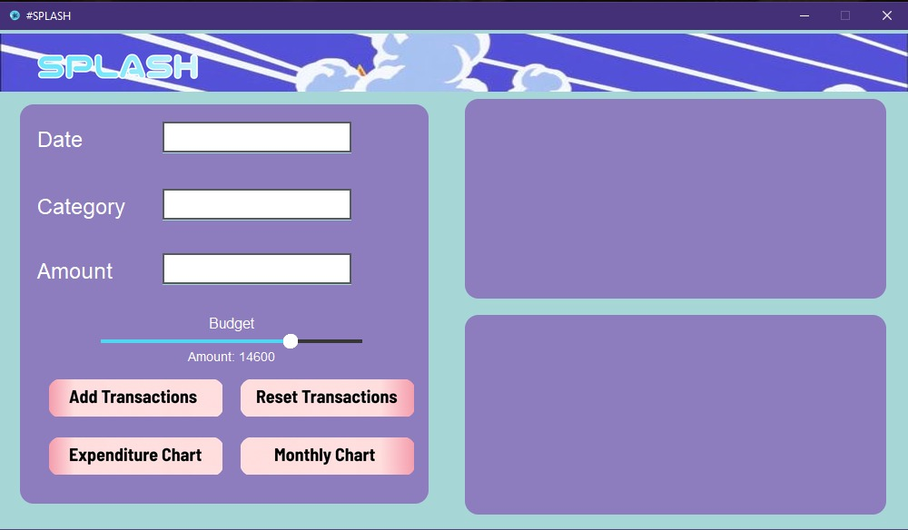
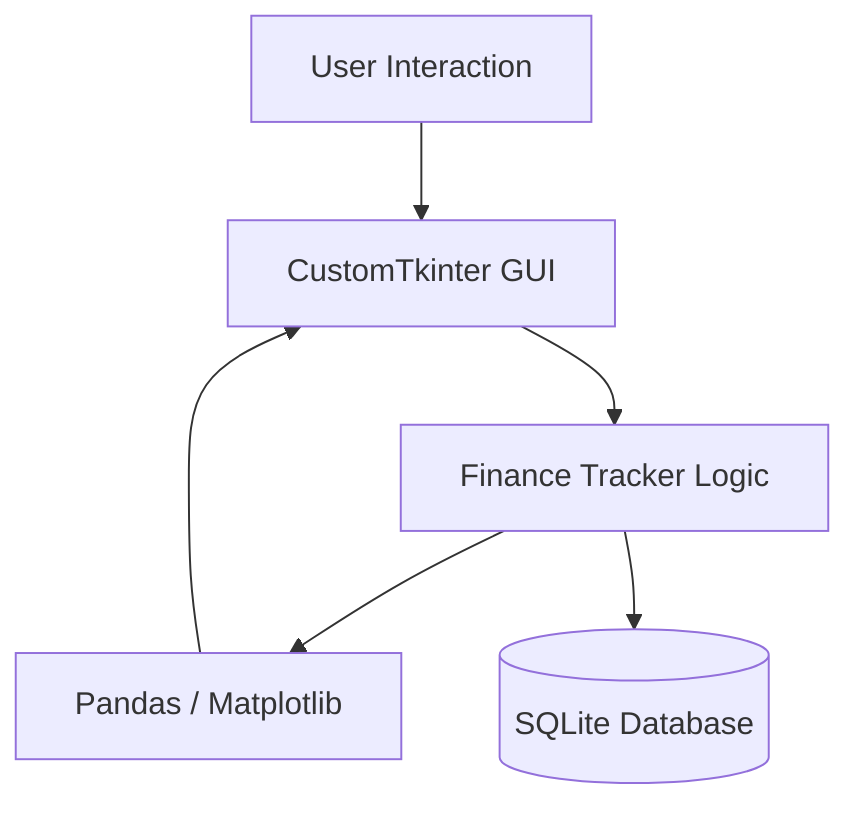
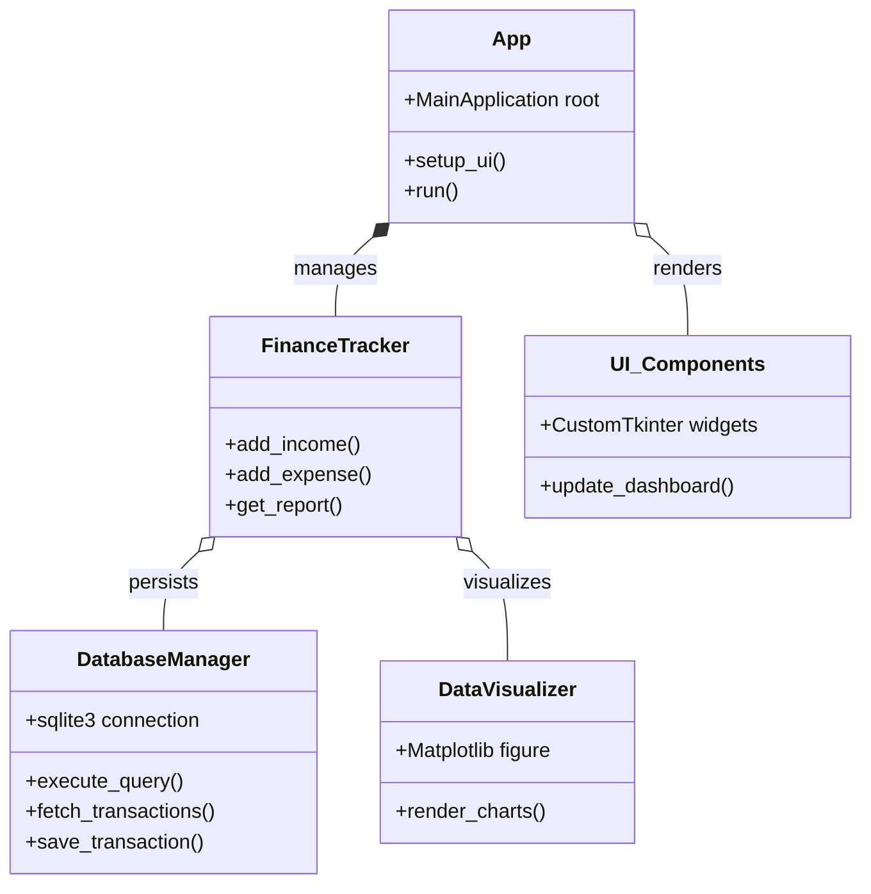

<div align="center">

# Splash Finance Tracker

**Desktop-based personal finance management with real-time analytics & local SQLite storage**

[](https://python.org)
[](https://github.com/TomSchimansky/CustomTkinter)
[](https://pandas.pydata.org)
[](https://sqlite.org)

</div>

## Display 
<div align="center">



</div>

## Architecture Overview
The application follows a modular structure separating UI concerns from data processing and database operations.



---
Based on the project structure of `finance-tracker-gui`, here is a suggested `README.md` structure. Since this is a desktop application using `CustomTkinter` and `SQLite`, the architecture focuses on the separation between the UI layer, the logic/data layer, and the persistent storage.



## Features
- **Transaction Management:** Add, view, and manage income and expense logs.
- **Visual Analytics:** Interactive charts and graphs powered by Matplotlib.
- **Persistent Storage:** Local SQLite database ensures data remains saved between sessions.
- **Easy Reset:** Manual transaction database reset capability.

## Technical Stack
- **Language:** Python
- **GUI Framework:** CustomTkinter
- **Data Handling:** Pandas
- **Visualization:** Matplotlib
- **Database:** SQLite

---
*Note: This project is currently on a indefinite hiatus phase. Features such as login authorization are planned for future updates.*
```
